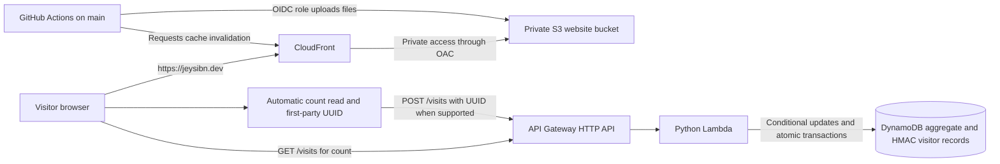

# Architecture

## Live system: V2

The live portfolio runs in AWS account `665514296439`, region `ap-southeast-2`. CloudFront serves [jeysibn.dev](https://jeysibn.dev) from a private S3 bucket. The visitor API is an API Gateway HTTP API backed by Python Lambda and DynamoDB.


```mermaid
flowchart LR
    B[Visitor browser]
    C[Automatic count read and first-party UUID]
    CF[CloudFront]
    S3[Private S3 website bucket]
    API[API Gateway HTTP API]
    L[Python Lambda]
    DB[(DynamoDB aggregate and HMAC visitor records)]
    GH[GitHub Actions on main]

    B -->|https://jeysibn.dev| CF
    CF -->|Private access through OAC| S3
    B --> C
    B -->|GET /visits for count| API
    C -->|POST /visits with UUID when supported| API
    API --> L
    L -->|Conditional updates and atomic transactions| DB
    GH -->|OIDC role uploads files| S3
    GH -->|Requests cache invalidation| CF
```

### Visitor registration and counting

1. On page load, the portfolio requests `GET /visits` to display the aggregate. If registration is supported and localStorage is available, it registers with `POST /visits`. A random browser UUID v4 is stored in first-party localStorage and sent only to the API; the server stores only its keyed HMAC digest.
2. If registration is supported, the frontend automatically creates or reuses a browser UUID in localStorage and sends it to the API. Legacy consent preference values are ignored. If storage is unavailable, the aggregate still loads and registration is skipped. Automatic recognition is a product behavior, not a conclusion that consent is unnecessary.
3. `POST /visits` sends `{ "visitorId": "<UUID v4>" }`. Lambda validates the shape, HMAC-SHA256 hashes it with the existing Terraform-managed secret, and uses `visitor#<digest>` as the DynamoDB key. Raw IDs are not stored or logged.
4. A new browser or one whose `active_until` is at or before the current UTC time increments the existing `visitors.count` in the same DynamoDB transaction that writes visitor state. A visit inside the active window updates its history and extends the deadline without changing the aggregate. Conditional writes resolve concurrent requests.
5. React StrictMode replays and concurrent remounts share an in-flight registration promise; settled promises are cleared so a later mount/page load extends activity. If GET succeeds but POST fails, the fetched aggregate remains visible. If GET fails, a Retry control performs GET only, avoiding accidental registration retries. Responses use `Cache-Control: no-store`.

### DynamoDB records and retention

The existing table key is `id`. The `id = visitors` item and its historical count are preserved. Anonymous browser records use `id = visitor#<server-derived HMAC digest>` and store UTC Unix-second timestamps and counters:

| Attribute | Meaning |
| --- | --- |
| `first_seen_at` | First recorded visit in the current retained history period; reset when `expires_at <= now`, even if the item remains physically present. |
| `last_seen_at` | Most recent accepted registration. |
| `active_until` | Application eligibility deadline, set to the latest visit plus 86,400 seconds. This controls counting; DynamoDB TTL is not consulted. |
| `page_loads` | Total accepted registrations observed for this browser record. |
| `counted_visits` | Eligible visits that incremented the aggregate for this browser record. |
| `is_returning` | True after a repeat registration has been observed. |
| `expires_at` | Separate logical history-retention deadline and DynamoDB TTL deadline, refreshed to 90 days after the latest registration. |

UTC epoch seconds are convenient for comparisons; convert them to `Asia/Manila` when reviewing operational records. `active_until` determines whether a registration counts again after 24 hours. Independently, once `expires_at <= now`, the handler treats a still-present record as a new retained history period: it replaces `first_seen_at` and resets activity counters, returning status, and both deadlines while incrementing the aggregate atomically. A conditional write verifies the observed expiration so concurrent resets count once; if TTL deletes the item between read and transaction, the handler rereads and creates a first-visit record. DynamoDB physical TTL deletion remains asynchronous and can lag the logical deadline. There is no secondary index and no scan on public requests. Private operational review can scan the table; that is an off-path, potentially paginated read, not an analytics endpoint. Restrict AWS console and CLI permissions because records contain visit history and HMAC identifiers.

An authorized operator can inspect recent records without exposing them publicly:

```bash
aws dynamodb scan \
  --table-name cloud-resume-v2-visitor-counter \
  --filter-expression 'begins_with(#id, :prefix)' \
  --projection-expression '#id, first_seen_at, last_seen_at, active_until, page_loads, counted_visits, is_returning, expires_at' \
  --expression-attribute-names '{"#id":"id"}' \
  --expression-attribute-values '{":prefix":{"S":"visitor#"}}'
```

The command is read-only, may return several pages, and should be used sparingly. The HMAC key is in restricted Terraform state and Lambda configuration. The Lambda role is scoped to table `GetItem`, `PutItem`, and `UpdateItem`; API Gateway retains its existing 2 requests/second rate and burst 5 throttles.

### Privacy and interpretation

The counter has two distinct functions: aggregate counting (`GET /visits`), which reads the public total without creating an identifier, and persistent browser recognition (`POST /visits`), which stores/reuses a random first-party UUID and sends it to Lambda. The UUID identifies a browser token, not a person. Lambda stores its keyed HMAC digest and limited timestamps/counters in private DynamoDB; records use a 90-day inactivity retention deadline and asynchronous TTL cleanup. The global aggregate is never deleted.

The site automatically recognizes a browser when the backend supports registration and browser storage is available. There is no visitor-facing enable/disable control; legacy `jeysibn.visitor-counting-consent.v1` values are ignored. Browser storage can be cleared, copied, blocked, or spoofed; shared browsers share recognition and browser changes lose it. The unauthenticated API is not bot protection. Counts are recorded eligible visits, not unique humans; legacy aggregate totals also include prior IP-derived counting.

**Production privacy-review checkpoint:** automatic UUID creation and use has not been legally cleared. First-party storage, pseudonymization, and legitimate interest do not automatically remove consent or notice duties. Before production release, the site owner must assess user locations, purpose, lawful basis, notice, retention, and whether this automatic behavior is permitted. The frontend no longer has a visitor opt-in mode. Review the [NPC Data Privacy Act](https://privacy.gov.ph/data-privacy-act/), [NPC advisories and Circular 2023-04](https://privacy.gov.ph/pips-and-pics/advisories-circulars/), and [EDPB technical-scope guidelines](https://www.edpb.europa.eu/documents/guideline/guidelines-22023-on-technical-scope-art-53-of-eprivacy-directive_en).

### Migration and deployment

No data migration is required. The aggregate `visitors` item is not managed by Terraform and is not reset. Existing `ip#...` items are not mapped to browsers; TTL removes them eventually. The new handler writes `visitor#...` records. Enhanced `GET /visits` includes `registrationSupported: true`. The frontend checks this flag before sending an automatic UUID registration. A legacy backend lacks this flag, so the frontend displays the aggregate with GET only and sends no POST. The enhanced backend accepts a legacy bodyless POST as a read-only compatibility request and returns `{ "counted": false, "count": n }`; it creates no record and performs no IP-derived tracking. Keep this low-risk compatibility path deliberately until a planned breaking API change after legacy clients are no longer supported. These mixed-version combinations preserve display but cause a temporary registration gap.

Deploy the compatible backend first, verify it, then publish the frontend through the manually approved V2 Portfolio CI/CD workflow. This PR changes no infrastructure and requires no Terraform apply. Keep the enhanced backend for rollback and revert the frontend first. The legacy backend capability response prevents registration when the new frontend sees the old service. Avoid backend-only rollback while cached clients may remain open. Never run an unreviewed Terraform plan or apply; the [backend runbook](backend-cicd.md) describes the gated release and rollback.

## Frontend deployment flow

Pull requests to `main` run frontend and backend checks. A maintainer separately reviews and applies any approved Terraform plan, then manually starts **V2 Portfolio CI/CD** on `main` to publish the frontend. The workflow uses GitHub OIDC, uploads assets before `index.html`, and requests a CloudFront invalidation. The frontend automatically registers browsers when the API advertises support and localStorage is available. The workflow does not apply Terraform.

## Estimated total visitor-counter request costs and actual incremental cost

Estimate for `ap-southeast-2` (Sydney), USD, using AWS public on-demand prices checked 2026-11-07. Each page load adds two HTTP API requests and two Lambda invocations (GET and POST). Assume 256 MB Lambda memory and 100 ms average duration per invocation. The GET path uses one strongly consistent DynamoDB read. POST uses one strongly consistent visitor read plus one strongly consistent aggregate read. Assume records fit under 4 KB; repeat visits use one ordinary write, while an eligible visit uses a two-item transaction (four write request units if each item fits in 1 KB). For a conservative upper bound, treat every page load as eligible; repeated visits cost less in writes. Use Sydney on-demand rates of $1.29 per million HTTP API requests and $0.1425 / $0.71 per million DynamoDB read / write request units from the AWS Price List. Lambda uses $0.20 per million requests and $0.0000166667 per GB-second. Free-tier pricing is excluded; actual data transfer, logs, storage, credits, and account billing can change the invoice.

| Page loads/month | HTTP API requests | Lambda invocations | DynamoDB reads (RRUs) | DynamoDB writes (WRUs, eligible upper bound) | Estimated total monthly cost (all loads recognized) |
| ---: | ---: | ---: | ---: | ---: | ---: |
| 100 | 200 | 200 | 300 | 400 | ~$0.00071 |
| 1,000 | 2,000 | 2,000 | 3,000 | 4,000 | ~$0.0071 |
| 10,000 | 20,000 | 20,000 | 30,000 | 40,000 | ~$0.071 |

These are estimated total visitor-counter request costs assuming every page load makes both GET and POST. The prior opt-in implementation already made GET+POST for enabled browsers and GET only for declined visitors. Actual incremental cost versus that implementation depends on how many loads previously had recognition enabled. A newly registered load that was previously GET-only adds about $0.0000029 for an active repeat or about $0.0000050 for an eligible counted visit under these assumptions; previously registered loads add close to zero request cost relative to the old flow. Approximate incremental amounts for 100, 1,000, and 10,000 formerly GET-only loads are therefore $0.00029–$0.00050, $0.0029–$0.0050, and $0.029–$0.050, respectively. These are illustrative estimates, not precise monthly billing. At these volumes, extending `expires_at` on every return visit adds one standard write request unit per visit. It is needed to retain the HMAC record for the stated 90-day inactivity retention; `active_until` independently extends by 86,400 seconds on each recognized active visit. DynamoDB TTL is asynchronous cleanup, not the eligibility check. The estimates exclude existing resource costs, CloudWatch logs, data transfer, DynamoDB storage, and possible AWS Free Tier benefits. Rates were taken from AWS's [Sydney API Gateway price list](https://pricing.us-east-1.amazonaws.com/offers/v1.0/aws/AmazonApiGateway/current/region_index.json), [Sydney DynamoDB price list](https://pricing.us-east-1.amazonaws.com/offers/v1.0/aws/AmazonDynamoDB/current/region_index.json), [Sydney Lambda price list](https://pricing.us-east-1.amazonaws.com/offers/v1.0/aws/AWSLambda/current/region_index.json), and [DynamoDB read/write unit rules](https://docs.aws.amazon.com/amazondynamodb/latest/developerguide/read-write-operations.html).

## V1 history

V1 was manually provisioned in an older AWS project, which has since closed. Its source remains historical and its AWS state must not be reused.
